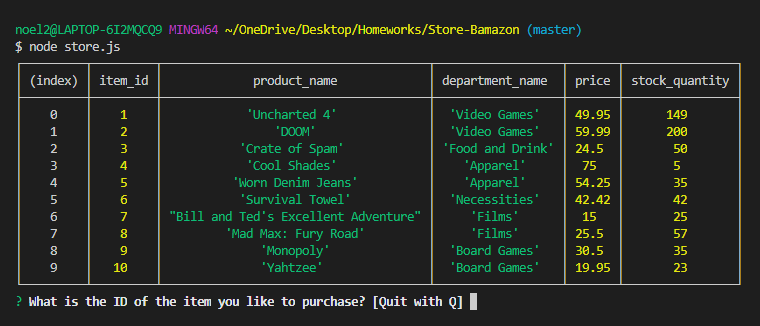
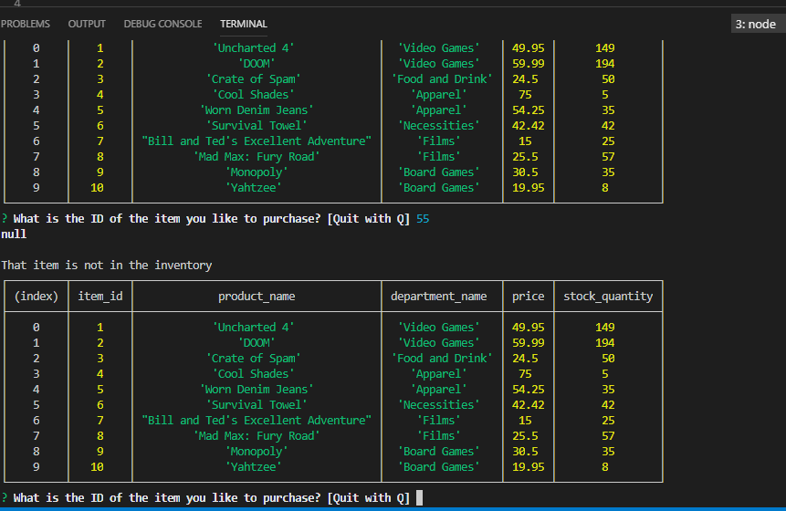
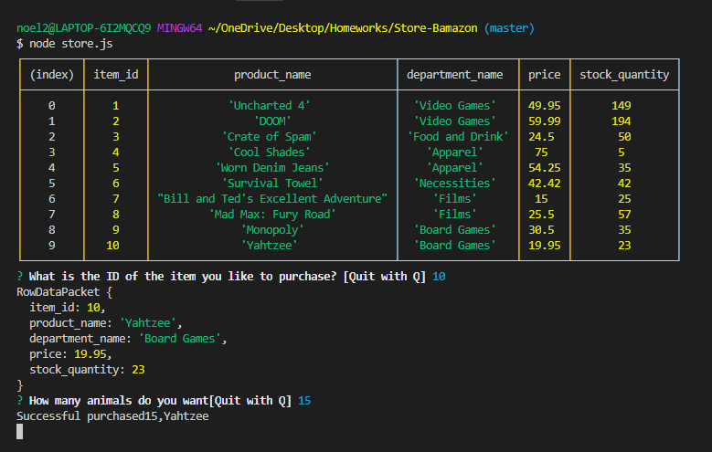

# Store-Bamazon
NodeJS-MySql
CLI client, storefront utilizing MySql to format into tables

Bamazon Store

The Bamazon storefront is a JavaScript node application that runs using MySQL as the database.

The program can be run by loading the JavaScript file in node and following the customer prompt questions. The customer application allows the user to choose what they'd like to purchase and as a result the stock is diminished.

The Manager view allows the Manager to view products for sale, view low inventory, re-stock the inventory and add new and different products to the storefront.

Instructions and Description of CLI Application

Here is a screenshot showing the Bamazon customer storefront to the user.

 

 

 